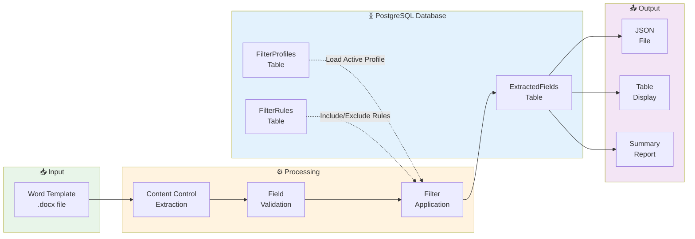
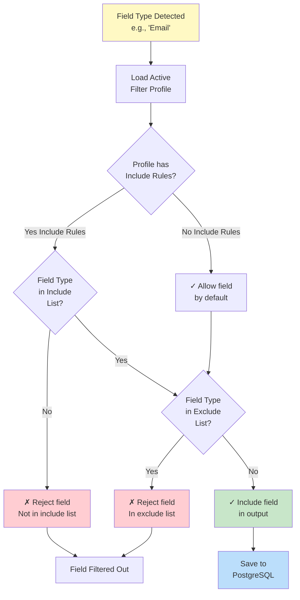
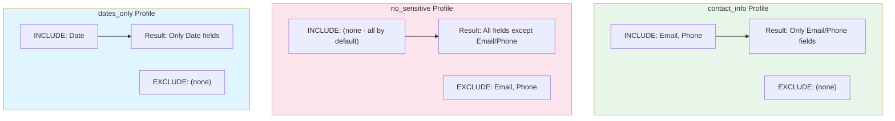
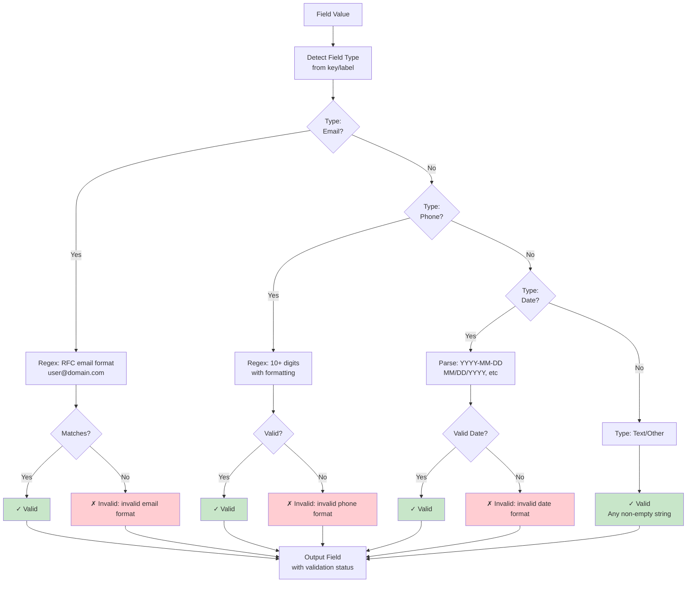
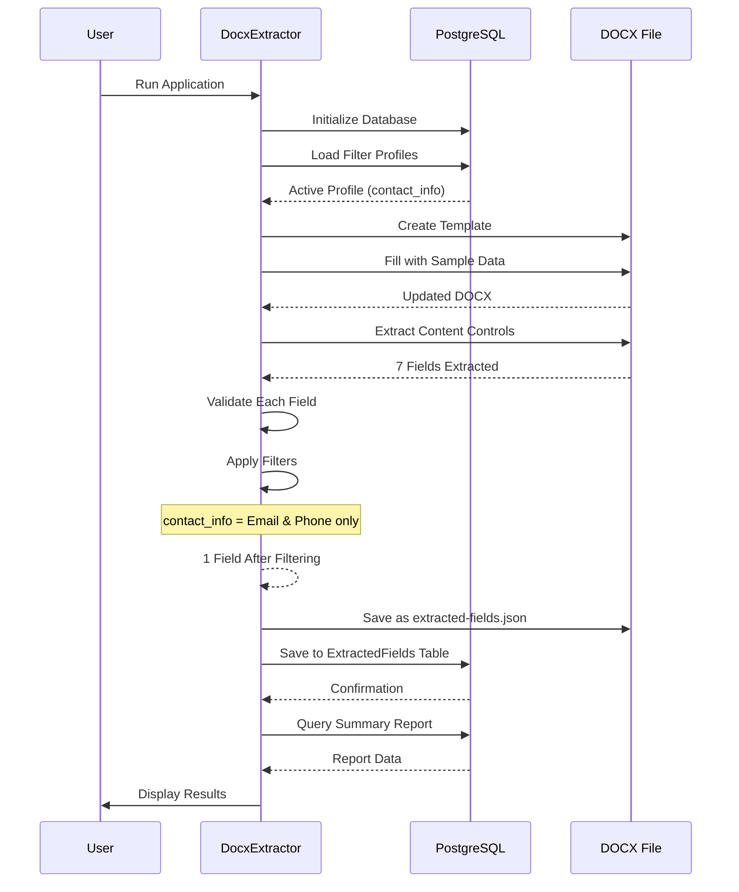
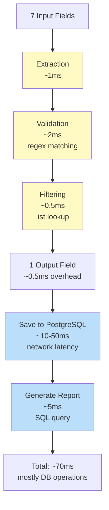

# Data Flow Diagram - DOCX Extractor

## System Architecture Flow

```mermaid
graph TD
    Start([Start Application]) --> Init[Initialize Database]
    Init --> CreateProfiles[Create/Update Filter Profiles]
    CreateProfiles --> CreateTemplate[Step 1: Create Sample Template]
    
    CreateTemplate --> FillTemplate[Step 2: Fill Template with Sample Data]
    FillTemplate --> ExtractFields[Step 3: Extract Fields from DOCX]
    
    ExtractFields --> FieldList["📋 Extracted Fields<br/>7 fields total"]
    
    FieldList --> Validate[Step 4: Validate Field Values]
    Validate --> ValidationCheck{Field Valid?}
    
    ValidationCheck -->|Valid| ValidField["✓ Keep original value"]
    ValidationCheck -->|Invalid| InvalidField["✗ Append error message"]
    
    ValidField --> FilterStep[Step 5: Apply Filter Profile]
    InvalidField --> FilterStep
    
    FilterStep --> GetFilter["Load Active Filter Profile<br/>from PostgreSQL"]
    GetFilter --> FilterCheck{Field Type<br/>in Include List?}
    
    FilterCheck -->|No Include Rules| IncludeAll["Include all fields"]
    FilterCheck -->|Yes, Field Matches| Include["Include field"]
    FilterCheck -->|No Match| Exclude["Exclude field"]
    
    IncludeAll --> CheckExclude{Field Type<br/>in Exclude List?}
    Include --> CheckExclude
    Exclude --> ExcludeResult["Skip field"]
    
    CheckExclude -->|Yes, Field Matches| ExcludeResult
    CheckExclude -->|No Match| FilteredList["Filtered Fields"]
    
    ExcludeResult --> FilteredList
    
    FilteredList --> JsonOutput[Step 6: Generate JSON Output]
    JsonOutput --> JsonFile["📄 extracted-fields.json"]
    
    JsonFile --> TableOutput[Step 7: Generate Table Output]
    TableOutput --> TableDisplay["📊 Formatted Table"]
    
    TableDisplay --> SaveDB[Step 8: Save to PostgreSQL]
    SaveDB --> ExtractedFieldsTable["🗄️ ExtractedFields Table<br/>Columns: Id, DocumentName,<br/>FilterProfileName, FieldKey,<br/>FieldLabel, FieldValue,<br/>FieldType, IsValid,<br/>ValidationMessage,<br/>ExtractedAt"]
    
    ExtractedFieldsTable --> Report[Step 9: Generate Report]
    Report --> SummaryReport["📊 Summary Report<br/>• Total fields<br/>• Valid/Invalid count<br/>• Fields by type<br/>• Error summary"]
    
    SummaryReport --> Complete([Complete ✓])
    
    style Start fill:#e1f5e1
    style Complete fill:#e1f5e1
    style FieldList fill:#fff4e6
    style FilteredList fill:#fff4e6
    style ExtractedFieldsTable fill:#e3f2fd
    style SummaryReport fill:#f3e5f5
    style ValidField fill:#c8e6c9
    style InvalidField fill:#ffcdd2
    style Include fill:#c8e6c9
    style Exclude fill:#ffcdd2
```



## Data Transformation Pipeline



## Filter Logic Decision Tree



## Sample Filter Profiles



## Database Schema Relationships

```mermaid
erDiagram
    FILTERPROFILES ||--o{ FILTERRULES : contains
    FILTERPROFILES ||--o{ EXTRACTEDFIELDS : "filtered by"
    
    FILTERPROFILES {
        int Id PK
        string Name UK
        string Description
        boolean IsActive
        timestamp CreatedAt
        timestamp UpdatedAt
    }
    
    FILTERRULES {
        int Id PK
        int FilterProfileId FK
        string FieldType
        boolean IsIncludeRule
        timestamp CreatedAt
    }
    
    EXTRACTEDFIELDS {
        int Id PK
        string DocumentName IX
        string FilterProfileName IX
        string FieldKey
        string FieldLabel
        string FieldValue
        string FieldType IX
        boolean IsValid IX
        string ValidationMessage
        timestamp ExtractedAt IX
    }
```

## Field Validation Rules



## Execution Timeline



## Performance Considerations


